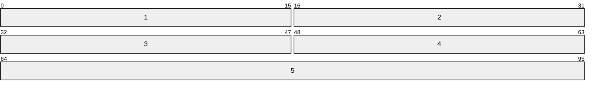

## Definition
One of the core protocols of the internet suite, UDP is a connectionless protocol that maximizes speed and efficiency at the cost of [[TCP]] reliability and error detection. It provides a datagram mode of packet-switched computer communication on top of the [[IP]]

## UDP Datagram

1. **Source Port \[0x00: 2B\]:** Optional field indicating the sending port of the source
2. **Destination Port \[0x02: 2B\]:** Indicates the destination port
3. **Length \[0x04: 2B\]:** The packet length in bytes
4. **Checksum \[0x06: 2B\]:** A zero padded one's complement of the one's complement sum of a [[UDP#Pseudo-Header|pseudo-header]] and the UDP header and data
5. **Data \[0x08: 0~1472B\]:** The data transmitted

### Pseudo-Header

## External References
- [en.wikipedia.org](https://en.wikipedia.org/wiki/User_Datagram_Protocol)
- [datatracker.ietf.org/rfc768](https://datatracker.ietf.org/doc/html/rfc768)
