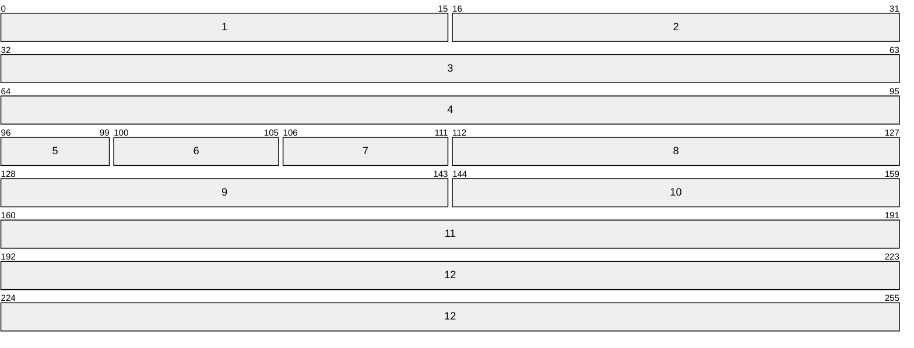

## Definition
One of the core protocols of the internet suite, TCP is a connection-oriented protocol that provides a reliable, in-order, byte-stream service to applications with loss-detection capabilities on top of [[IP]]

## TCP Segment

1. **Source Port \[0x00: 16b\]:** Identifies the sending port
2. **Destination Port \[0x10: 16b\]:** Identifies the recieving port
3. **Sequence Number \[0x20: 32b\]:** The sequence number of the first data byte in this segment. If SYN flag is set, this represents the [ISN]{Initial Sequence Number}
4. **Acknowledment Number \[0x40: 32b\]:** Indicates the next sequence number that the sender is expecting to recieve
5. **Data Offset \[0x60: 4b\]:** Indicates the data offset (in 32 bit-words) position in the segment
6. **Reserved \[0x64: 4b\]:** A set of control bits reserved for future use, must be zero when generated and ignored when recieved
7. **Control bits \[0x68: 8b\]:** The TCP flags
	1. **[CWR]{Congestion Window Reduced} \[0x68: 1b\]:** A TCP segment with the ECE flag set was recieved and responded in congestion control mechanism
	2. **[ECE]{ECN-Echo} \[0x69: 1b\]:** Depending on the SYN flag state, indicates that:
		- **SYN up:** The sending host is [ECN]{Explicit Congestion Notification} capable
		- **SYN down:** A packet with the ECN flag set in the [[IP]] header was recieved during normal transmission
	3. **[URG]{Urgent} \[0x6a: 1b\]:** The urgent pointer field is significant
	4. **[ACK]{Acknowledge} \[0x6b: 1b\]:** The acknowledgment field is significant
	5. **[PSH]{Push} \[0x6c: 1b\]:** Push function
	6. **[RST]{Reset} \[0x6d: 1b\]:** Reset the connection
	7. **[SYN]{Synchronize} \[0x6e: 1b\]:** Synchronize sequence numbers
	8. **[FIN]{Finalize} \[0x6f: 1b\]:** No more data from sender
8. **Window \[0x70: 16b\]:** The number of data bytes (begining with the one indicated in the ACK Number) that the sender is willing to accept
9. **Checksum \[0x80: 16b\]:** A zero padded 16-bit ones' complement of the ones' complement sum of all 16-bit words in the [[TCP#Pseudo-Header|pseudo-header]], header and data
10. **Urgent Pointer \[0x90: 16b\]:** When the URG flag is set, indicates the current positive offset from the sequence number in this segment pointing to last urgent data byte
11. **Options \[0xa0: 32b\]:** Only present when the data offset is bigger than 5, it indicates TCP options:
	1. **Kind \[0xa0: 8b\]:**
	2. **Length \[0xa8: 8b\]:**
	3. **Data \[0xaf: 8b\]:**
12. **Data \[0xc0: b\]:** This segment data

### Pseudo-Header

### TCP Options

## Checksum

## Events
Open
Send
Recieve
Close
Status
Abort
Flush
Asynchronous Reports

## Three-Way Handshake

## Ports

## External References
[en.wikipedia.org](https://en.wikipedia.org/wiki/Transmission_Control_Protocol)
[datatracker.ietf.org/rfc3168](https://datatracker.ietf.org/doc/html/rfc3168)
[datatracker.ietf.org/rfc9293](https://datatracker.ietf.org/doc/html/rfc9293)
