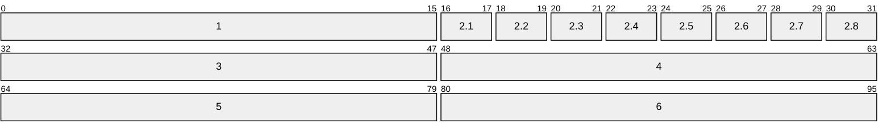

## Definition
The [DNS]{Domain Name System} is a distributed and hierarchical database system designed to map human-readable [[DNS#Fully Qualified Domain Name|FQDNs]] to machine-readable identifiers (primarily [[IP]] addresses). It operates as a critical infrastructure component through a tripartite architecture:
- **Domain Name Space:** The hierarchical tree structured name space where the [[DNS#Resource Records|resource records]] are stored
- **Name Servers:** A server that holds information about the Domain Name Space, which is composed of two kinds of data:
	- **Authoritative:** The zones are complete databases for a particular subtree of a domain space
	- **Cached:** Incomplete piece of data recently acquired by a local resolver, it is stored in cache to improve efficiency and retrieve times
- **Resolvers:** A program that extract information from name servers in answer to a request, usually originated from an OS call in its own host

|DNS Concept|Description|Example|
|---|---|---|
|`Domain Name`|A human-readable label for a website or other internet resource.|`www.example.com`|
|`IP Address`|A unique numerical identifier assigned to each device connected to the internet.|`192.0.2.1`|
|`DNS Resolver`|A server that translates domain names into IP addresses.|Your ISP's DNS server or public resolvers like Google DNS (`8.8.8.8`)|
|`Root Name Server`|The top-level servers in the DNS hierarchy.|There are 13 root servers worldwide, named A-M: `a.root-servers.net`|
|`TLD Name Server`|Servers responsible for specific top-level domains (e.g., .com, .org).|[Verisign](https://en.wikipedia.org/wiki/Verisign) for `.com`, [PIR](https://en.wikipedia.org/wiki/Public_Interest_Registry) for `.org`|
|`Authoritative Name Server`|The server that holds the actual IP address for a domain.|Often managed by hosting providers or domain registrars.|
|`DNS Record Types`|Different types of information stored in DNS.|A, AAAA, CNAME, MX, NS, TXT, etc.|

## DNS Packet



1. **Transaction ID \[0x00: 16b\]:**
2. **Flags \[0x10: 16b\]:**
	1. **QR \[0x10: 2b\]:**
	2. **Opcode \[0x12: 2b\]:**
	3. **AA \[0x14: 2b\]:**
	4. **TC \[0x16: 2b\]:**
	5. **RD \[0x17: 2b\]:**
	6. **RA \[0x1a: 2b\]:**
	7. **Z \[0x1c: 2b\]:**
	8. **RCODE \[0x1e: 2b\]:**
3. **QDCOUNT \[0x20: 0b\]:**
4. **ANCOUNT \[0x30: 0b\]:**
5. **NSCOUNT \[0x40: 0b\]:**
6. **ARCOUNT \[0x50: 0b\]:**

## DNS Query
INSERT THE QUERYING PROCESS WITH DIAGRAMS
dns query
1. `Your Computer Asks for Directions (DNS Query)`: When you enter the domain name, your computer first checks its memory (cache) to see if it remembers the IP address from a previous visit. If not, it reaches out to a DNS resolver, usually provided by your internet service provider (ISP).
2. `The DNS Resolver Checks its Map (Recursive Lookup)`: The resolver also has a cache, and if it doesn't find the IP address there, it starts a journey through the DNS hierarchy. It begins by asking a root name server, which is like the librarian of the internet.
3. `Root Name Server Points the Way`: The root server doesn't know the exact address but knows who does – the Top-Level Domain (TLD) name server responsible for the domain's ending (e.g., .com, .org). It points the resolver in the right direction.
4. `TLD Name Server Narrows It Down`: The TLD name server is like a regional map. It knows which authoritative name server is responsible for the specific domain you're looking for (e.g., `example.com`) and sends the resolver there.
5. `Authoritative Name Server Delivers the Address`: The authoritative name server is the final stop. It's like the street address of the website you want. It holds the correct IP address and sends it back to the resolver.
6. `The DNS Resolver Returns the Information`: The resolver receives the IP address and gives it to your computer. It also remembers it for a while (caches it), in case you want to revisit the website soon.
7. `Your Computer Connects`: Now that your computer knows the IP address, it can connect directly to the web server hosting the website, and you can start browsing.

axfr
1. `Zone Transfer Request (AXFR)`: The secondary DNS server initiates the process by sending a zone transfer request to the primary server. This request typically uses the AXFR (Full Zone Transfer) type.
2. `SOA Record Transfer`: Upon receiving the request (and potentially authenticating the secondary server), the primary server responds by sending its Start of Authority (SOA) record. The SOA record contains vital information about the zone, including its serial number, which helps the secondary server determine if its zone data is current.
3. `DNS Records Transmission`: The primary server then transfers all the DNS records in the zone to the secondary server, one by one. This includes records like A, AAAA, MX, CNAME, NS, and others that define the domain's subdomains, mail servers, name servers, and other configurations.
4. `Zone Transfer Complete`: Once all records have been transmitted, the primary server signals the end of the zone transfer. This notification informs the secondary server that it has received a complete copy of the zone data.
5. `Acknowledgement (ACK)`: The secondary server sends an acknowledgement message to the primary server, confirming the successful receipt and processing of the zone data. This completes the zone transfer process.

```txt
                 Local Host                        |  Foreign
                                                   |
    +---------+               +----------+         |  +--------+
    |         | user queries  |          |queries  |  |        |
    |  User   |-------------->|          |---------|->|Foreign |
    | Program |               | Resolver |         |  |  Name  |
    |         |<--------------|          |<--------|--| Server |
    |         | user responses|          |responses|  |        |
    +---------+               +----------+         |  +--------+
                                |     A            |
                cache additions |     | references |
                                V     |            |
                              +----------+         |
                              |  cache   |         |
                              +----------+         |
```

```txt
                 Local Host                        |  Foreign
                                                   |
      +---------+                                  |
     /         /|                                  |
    +---------+ |             +----------+         |  +--------+
    |         | |             |          |responses|  |        |
    |         | |             |   Name   |---------|->|Foreign |
    |  Master |-------------->|  Server  |         |  |Resolver|
    |  files  | |             |          |<--------|--|        |
    |         |/              |          | queries |  +--------+
    +---------+               +----------+         |
```

host that supports all aspects of the domain name system

```txt
                 Local Host                        |  Foreign
                                                   |
    +---------+               +----------+         |  +--------+
    |         | user queries  |          |queries  |  |        |
    |  User   |-------------->|          |---------|->|Foreign |
    | Program |               | Resolver |         |  |  Name  |
    |         |<--------------|          |<--------|--| Server |
    |         | user responses|          |responses|  |        |
    +---------+               +----------+         |  +--------+
                                |     A            |
                cache additions |     | references |
                                V     |            |
                              +----------+         |
                              |  Shared  |         |
                              | database |         |
                              +----------+         |
                                A     |            |
      +---------+     refreshes |     | references |
     /         /|               |     V            |
    +---------+ |             +----------+         |  +--------+
    |         | |             |          |responses|  |        |
    |         | |             |   Name   |---------|->|Foreign |
    |  Master |-------------->|  Server  |         |  |Resolver|
    |  files  | |             |          |<--------|--|        |
    |         |/              |          | queries |  +--------+
    +---------+               +----------+         |
                                A     |maintenance |  +--------+
                                |     +------------|->|        |
                                |      queries     |  |Foreign |
                                |                  |  |  Name  |
                                +------------------|--| Server |
                             maintenance responses |  +--------+
```

### Reverse Query
DESCRIBE REVERSE QUERY

## Resource Records
### Structure
DRAW TREE LIKE STRUCTURE

### Fully Qualified Domain Name

### Records
- **NS**: Nameserver records contain the name of the authoritative servers hosting the DNS records for a domain.
- **A**: Also known as a host record, the "_a record_" contains the IPv4 address of a hostname (such as <www.megacorpone.com>).
- **AAAA**: Also known as a quad A host record, the "_aaaa record_" contains the IPv6 address of a hostname (such as <www.megacorpone.com>).
- **MX**: Mail Exchange records contain the names of the servers responsible for handling email for the domain. A domain can contain multiple MX records.
- **PTR**: Pointer Records are used in reverse lookup zones and can find the records associated with an IP address.
- **CNAME**: Canonical Name Records are used to create aliases for other host records.
- **TXT**: Text records can contain any arbitrary data and be used for various purposes, such as domain ownership verification.

|Record Type|Full Name|Description|Zone File Example|
|---|---|---|---|
|`A`|Address Record|Maps a hostname to its IPv4 address.|`www.example.com.` IN A `192.0.2.1`|
|`AAAA`|IPv6 Address Record|Maps a hostname to its IPv6 address.|`www.example.com.` IN AAAA `2001:db8:85a3::8a2e:370:7334`|
|`CNAME`|Canonical Name Record|Creates an alias for a hostname, pointing it to another hostname.|`blog.example.com.` IN CNAME `webserver.example.net.`|
|`MX`|Mail Exchange Record|Specifies the mail server(s) responsible for handling email for the domain.|`example.com.` IN MX 10 `mail.example.com.`|
|`NS`|Name Server Record|Delegates a DNS zone to a specific authoritative name server.|`example.com.` IN NS `ns1.example.com.`|
|`TXT`|Text Record|Stores arbitrary text information, often used for domain verification or security policies.|`example.com.` IN TXT `"v=spf1 mx -all"` (SPF record)|
|`SOA`|Start of Authority Record|Specifies administrative information about a DNS zone, including the primary name server, responsible person's email, and other parameters.|`example.com.` IN SOA `ns1.example.com. admin.example.com. 2024060301 10800 3600 604800 86400`|
|`SRV`|Service Record|Defines the hostname and port number for specific services.|`_sip._udp.example.com.` IN SRV 10 5 5060 `sipserver.example.com.`|
|`PTR`|Pointer Record|Used for reverse DNS lookups, mapping an IP address to a hostname.|`1.2.0.192.in-addr.arpa.` IN PTR `www.example.com.`|

## Relevant Reading
- [[Internet Protocol Suite#4. Application|Application layer]]

## External Reference
[en.wikipedia.org](https://en.wikipedia.org/wiki/Domain_Name_System)
[RFC1034 - DNS Concept](https://datatracker.ietf.org/doc/html/rfc1034)
[RFC1035 - DNS Implementation](https://datatracker.ietf.org/doc/html/rfc1035)
[RFC2181 - DNS Classifications](https://datatracker.ietf.org/doc/html/rfc2181)
[RFC2308 - DNS Ncache](https://datatracker.ietf.org/doc/html/rfc2308)
[RFC4033 - DNSSEC Introduction](https://datatracker.ietf.org/doc/html/rfc4033)
[RFC4034 - Records for DNSSEC Extensions](https://datatracker.ietf.org/doc/html/rfc4034)
[RFC5936 - DNS AXFR](https://datatracker.ietf.org/doc/html/rfc5936)
[RFC6895 - DNS IANA Considerations](https://datatracker.ietf.org/doc/html/rfc6895)
[iana.org/dns-parameters](https://www.iana.org/assignments/dns-parameters/dns-parameters.xhtml)
