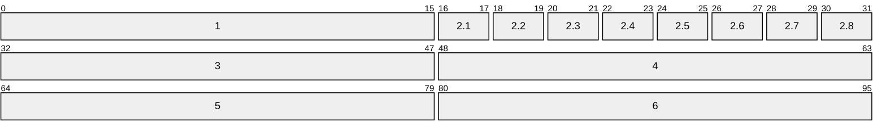

## Definition
The [DNS]{Domain Name System} is a distributed and hierarchical database system designed to map human-readable [FQDNs]{Fully Qualified Domain Names} to machine-readable identifiers (primarily [[IP]] addresses). It operates as a critical infrastructure component through a tripartite architecture:
- **Domain Name Space:** The hierarchical tree structured name space where the [[DNS#Resource Records|resource records are stored]]
- **Name Servers:** A server that holds information about the Domain Name Space, which is composed of two kinds of data:
	- **Authoritative:** The zones are complete databases for a particular subtree of a domain space
	- **Cached:** Incomplete piece of data recently acquired by a local resolver, it is stored in cache to improve efficiency and retrieve times
- **Resolvers:** A program that extract information from name servers in answer to a request, usually originated from an OS call in its own host

## DNS Packet

1. **Transaction ID \[0x00: 16b\]:** 
2. **Flags \[0x10: 16b\]:**
	1. **QR \[0x10: 2b\]:**
	2. **Opcode \[0x12: 2b\]:** 
	3. **AA \[0x14: 2b\]:** 
	4. **TC \[0x16: 2b\]:** 
	5. **RD \[0x17: 2b\]:** 
	6. **RA \[0x1a: 2b\]:** 
	7. **Z \[0x1c: 2b\]:** 
	8. **RCODE \[0x1e: 2b\]:** 
3. **QDCOUNT \[0x20: 0b\]:** 
4. **ANCOUNT \[0x30: 0b\]:** 
5. **NSCOUNT \[0x40: 0b\]:** 
6. **ARCOUNT \[0x50: 0b\]:** 

## DNS Query

## Resource Records

## Relevant Reading
- [[Internet Protocol Suite#4. Application|Application layer]]

## External Reference
[en.wikipedia.org](https://en.wikipedia.org/wiki/Domain_Name_System)
[RFC1034 - DNS Concept](https://datatracker.ietf.org/doc/html/rfc1034)
[RFC1035 - DNS Implementation](https://datatracker.ietf.org/doc/html/rfc1035)
[RFC2181 - DNS Classifications](https://datatracker.ietf.org/doc/html/rfc2181)
[RFC2308 - DNS Ncache](https://datatracker.ietf.org/doc/html/rfc2308)
[RFC4033 - DNSSEC Introduction](https://datatracker.ietf.org/doc/html/rfc4033)
[RFC4034 - Records for DNSSEC Extensions](https://datatracker.ietf.org/doc/html/rfc4034)
[RFC5936 - DNS AXFR](https://datatracker.ietf.org/doc/html/rfc5936)
[RFC6895 - DNS IANA Considerations](https://datatracker.ietf.org/doc/html/rfc6895)
[iana.org/dns-parameters](https://www.iana.org/assignments/dns-parameters/dns-parameters.xhtml)