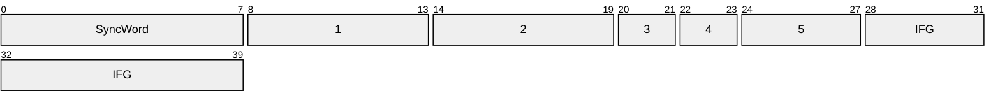

## Definition
Described in the [IEEE 802.3](https://standards.ieee.org/ieee/802.3/10422/), Ethernet is a family of wired computer networking technologies commonly used in [LAN]{Local Area Network}s, [MAN]{Metropolitan Area Network}s, and [WAN]{Wide Area Network}s. It defines the physical and data link layers of the [[Networks/OSI Model|OSI Model]], specifying how devices on a network format and transmit data so that other devices on the same network segment can recognize, receive, and process it

## Ethernet Stream

### SyncWord
1. **Preamble \[0x00: 7B\]:** An alternating pattern of ones and zeros used to synchronize the receiving devices clock
2. **[SFD]{Start Frame Delimiter} \[0x07: 1B\]:** The sequence `0b10101011` to signal the end of the preamble and the beginning of the actual frame

### Frame
1. **Destination MAC Address \[0x00: 6B\]:** The destination [[Low Level/MAC|MAC]] address, can be unicast, multicast or broadcast
2. **Source MAC Address \[0x06: 6B\]:** The unicast destination [[Low Level/MAC|MAC]] address
3. **Length/Tag \[0x0C: 2B\]:** Depending on the value, it can be the payload length or the payloads protocol
	- **Length \[0x0C: 2B\]:** Up to `0x05DC`, it indicates the payload length
	- **Tag Protocol Identifier(TPID) \[0x0E: 2B\]:** Also called [[Networks/Ethernet#EtherType|EtherType]], it specifies the protocol encapsulated in the payload
4. **Payload \[0x10: 46~1500B\]:** The actual data transmitted, where the size range is to comprehend the 64-byte minimum frame size (preamble and SFD are not part of the header) defined in the [[MAC#CSMA/CD|CSMA/CD]], and the 1500-byte [MTU]{Maximum Transmission Unit} defined by the [[Foundations/IEEE|IEEE]] (jumbo frames exist)
5. **[FCS]{Frame Check Sequence} \[0x10 + Payload: 4B\]:** A 4-byte [[Low Level/CRC|CRC]] to allow for the detection of any errors

### End of Frame
1. **[IFG]{Interfram Gap} \[0x00: 12B\]:** The minimum idle period between frames, primary intended for the receivers clock recovery and preparation for another packet

## EtherType
- `0x0800`: [[Networks/IP#IPv4|IPv4]]
- `0x0806`: [[Networks/ARP]]
- `0x0842`: [[Networks/Wake-on-LAN]]
- `0x86DD`: [[Networks/IP#IPv6|IPv6]]
- `0x8863`: [[Networks/PPPoE]] Discovery
- `0x8864`: [[Networks/PPPoE]] Session
- `0x88CC`: [[Networks/LLDP]]

## External References
[en.wikipedia.org/Ethernet](https://en.wikipedia.org/wiki/Ethernet)
[en.wikipedia.org/Ethernet_frame](https://en.wikipedia.org/wiki/Ethernet_frame)
[en.wikipedia.org/EtherType](https://en.wikipedia.org/wiki/EtherType)