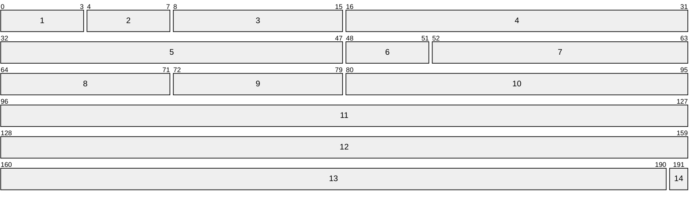
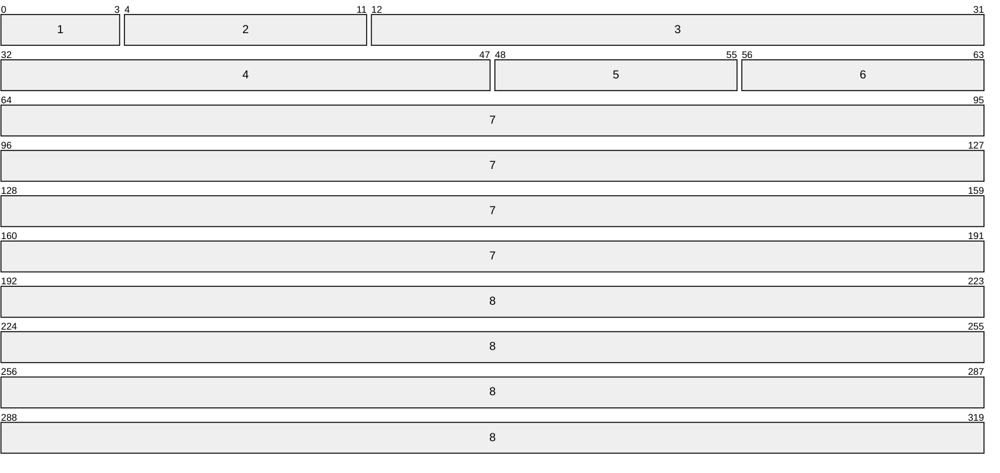

## Definition
The internet protocol is the principal communication protocol in the Internet Protocol suite for relaying datagrams across network boundaries, implementing the basic functions of addressing and fragmentation. In more modern networks, the [[IP#DS Field|DiffServ]] and [[IP#ECN|ECN]] are implemented. [[Internet Protocol Suite#2. Internet|internet]]

## Addressing Methods
- **Unicast:** Each destination address uniquely identifies a single receiver endpoint
- **Broadcast:** The destination address routes the packet, or datagram, to all possible endpoints in the network
- **Multicast:** The destination address routes the datagram to a specific group of endpoints in the network
- **Anycast:** Delivers the datagram to any one of the endpoints included in a specific group, usually the nearest in a group of hosts using the same address

## Address Architecture
### Classful

### Classless
REMEMBER TO READ: Classless Inter-Domain Routing

## IP Packet
### IPv4

1. **Version \[0x00: 4b\]:** Indicates the format of the internet header (4)
2. **[IHL]{Internet Header Length} \[0x04: 4b\]:** Length of the internet header in 32-bit words, therefore pointing to the beginning of the data
3. **[ToS]{Type of Service} \[0x08: 8b\]:** Indicator of the abstract parameters of the [QoS]{Quality of Service} desired (superseded by [[IP#DS Field|DS Field]])
	1. **Precedence \[0x08: 3b\]:** Network Control (`0b111`) | Internetwork Control (`0b110`) | CRITIC/ECP (`0b101`) | Flash Override (`0b100`) | Flash (`0b011`) | Immediate (`0b010`) | Priority (`0b001`) | Routine (`0b000`)
	2. **Delay \[0x0B: 1b\]:** Normal (`0b0`) | High(`0b1`)
	3. **Throughput \[0x0C: 1b\]:** Normal (`0b0`) | High(`0b1`)
	4. **Reliability \[0x0D: 1b\]:** Normal (`0b0`) | High(`0b1`)
	5. **Reserved \[0x0E: 2b\]:** Reserved for Future Use
4. **Length \[0x10: 16b\]:** The total length of the packet in bytes (All hosts must be prepared to accept datagrams of up to 576 octets)
5. **Identification \[0x20: 16b\]:** An identifying value assigned by the sender to aid in assembling the fragments of a datagram
6. **Flags \[0x30: 3b\]:**
	1. **Reserved \[0x30: 1b\]:** Reserved, must be 0
	2. **DF \[0x31: 1b\]:** Don't Fragment flag
	3. **MF \[0x32: 1b\]:** More Fragments flag
7. **Offset \[0x33: 13b\]:** Indicates this data offset (in 8 byte-words) position in the datagram
8. **[TTL]{Time to Live} \[0x40: 8b\]:** Indicates the maximum time that this packet is allowed to remain in the network
9. **Protocol \[0x48: 8b\]:** Indicates the next level protocol used in this packet data ([[IP#Protocol Numbers|IANA PN]])
10. **Header Checksum \[0x50: 16b\]:** This header checksum calculated through an algorithm based on one's complement addition (recomputed and checked at every hop)
11. **Source Address \[0x60: 32b\]:** The source address
12. **Destination Address \[0x80: 32b\]:** The destination address
13. **Options \[0xA0: 0~480b\]:** Optional variable-length settings
14. **Padding \[0xA0 + Options: 0~31b\]:** A 0-padding to ensure that the header ends on a 32-bit boundary

### IPv6

1. **Version \[0x00 4b\]:** Indicates the format of the internet header (6)
2. **Traffic Class \[0x00 8b\]:** Indicates the class or priority of the packet (superseded by [[IP#DS Field|DS Field]])
3. **Flow Label \[0x00 20b\]:** Used in conjunction with the source and destination address to identify the communication flow to which a packet belongs
4. **Payload Length\[0x00 16b\]:** The total length of the packet payload in octets
5. **Next Header\[0x00 8b\]:** Indicates the next level protocol used in this packet data ([[IP#Protocol Numbers|IANA PN]])
6. **Hop Limit \[0x00 8b\]:** Indicates the maximum time that this packet is allowed to remain in the network
7. **Source Address \[0x00 128b\]:** The source address
8. **Destination Address \[0x00 128b\]:** The destination address

### Protocol Numbers

## Extension Headers
### Hop-by-Hop Options

### Fragment

### Destination Options

### Routing

### Authentication

### Encapsulating Security Payload

## DS Field
The [DiffServ]{Differentiated Services} are intended to enable the deployment of scalable service discrimination in the internet by separating the architecture into two major components.

### ECN
The [ECN]{Explicit Congestion Notification} consists of two bits destined for for [AQM]{Active Queue Management}, Notifying endpoints of network congestion, effectivelly solving the need of [RED]{Random Early Detection} (droped-packets probbing)

### Header

1. **[DSCP]{Differentiated Services Codepoint} \[0x00 6b\]:** Separated in 3 pools:
	1. `0x?????0` With 32 possible values, this mask is destined for standards actions
	2. `0x????11` With 16 possible values, this mask is destined for experimental or local usage
	3. `0x????01` With 16 possible values, this mask is currently used in experimental or local usage, but is destined for standardized assignments after the exhaustion of pool 1
2. **[ECN]{Explicit Congestion Notification} \[0x06 2b\]:** Initially, it served no specific usage, but currently is destined for [[IP#ECN|ECN]]:
	1. `0x00`: [Non-ECT]{Non ECN-Capable Transport}, indicates that the communication is not using [[IP#ECN|ECN]]
	2. `0x01`: [ECT(1)]{ECN-Capable Transport}, indicates that the endpoint is capable of [[IP#ECN|ECN]]
	3. `0x10`: [ECT(0)]{ECN-Capable Transport}, indicates that the endpoint is capable of [[IP#ECN|ECN]]
	4. `0x11`: [CE]{Congestion Experienced}, indicates that the network is suffering with traffic congestion

## IPsec
IPSec is a interoperable, cryptographically-based security model for communication protection implemented in each host at the [[IP]] layer. Including a specification for minimal firewall implementation, it is negotiated via [IKEv2]{Internet Key Exchange version 2} and provided through two traffic security protocols, the [AH]{Authentication Header} and [ESP]{Encapsulating Security Payload}, following a [SPD]{Security Policy Database}. There are three possible "paths" for the IPSec to act:
1. between a pair of hosts
2. between a security gateway and a host
3. between a pair of security gateways

A compliant host must support the first two, and a security gateway must support all three of them.

## Relevant Reading
- [[Internet Protocol Suite]]
- [[Ethernet]]

## External References
[en.wikipedia.org](https://en.wikipedia.org/wiki/Internet_Protocol)
[RFC 791 - IP Specification](https://datatracker.ietf.org/doc/html/rfc791)
[RFC 1700 - Assigned Numbers](https://datatracker.ietf.org/doc/html/rfc1700)
[RFC 2474 - DS Field](https://datatracker.ietf.org/doc/html/rfc2474)
[RFC 3168 - IP ECN](https://datatracker.ietf.org/doc/html/rfc3168)
[RFC 4301 - Security Architecture for IP](https://datatracker.ietf.org/doc/html/rfc4301)
[RFC 4302 - IP AH](https://datatracker.ietf.org/doc/html/rfc4302)
[RFC 4303 - IP ESP](https://datatracker.ietf.org/doc/html/rfc4303)
[RFC 4303 - IKEv2](https://datatracker.ietf.org/doc/html/rfc4306)
[RFC 6437 - IPv6 Flow Label](https://datatracker.ietf.org/doc/html/rfc6437)
[RFC 8200 - IPv6 Specification](https://datatracker.ietf.org/doc/html/rfc8200)