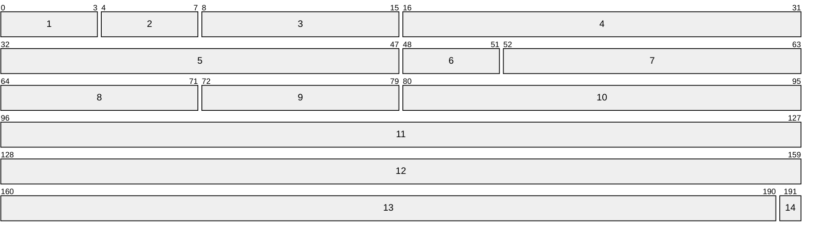

## Definition
The internet protocol is principal communication protocol in the Internet Protocol suite for relaying datagrams across network boundaries, implementing the basic functions of addressing and fragmentation. In more modern networks, the [[Networks/DiffServ|DiffServ]] and [[Networks/TCP|ECN]] are implemented.

## Addressing Methods
- **Unicast:** Each destination address uniquely identifies a single receiver endpoint
- **Broadcast:** The destination address routes the packet, or datagram, to all possible endpoints in the network
- **Multicast:** The destination address routes the datagram to a specific group of endpoints in the network
- **Anycast:** Delivers the datagram to any one of the endpoints included in a specific group, usually the nearest in a group of hosts using the same address

## Address Classes
Classless Inter-Domain Routing

## IPv4 Packet

1. **Version \[0x00: 4b\]:** Indicates the format of the internet header (4)
2. **[IHL]{Internet Header Length} \[0x04: 4b\]:** Length of the internet header in 32-bit words, therefore pointing to the beginning of the data
3. **[ToS]{Type of Service} \[0x08: 8b\]:** Indicator of the abstract parameters of the [QoS]{Quality of Service} desired
	1. **Precedence \[0x08: 3b\]:** `[0b111]{Network Control}` | `[0b110]{Internetwork Control}` | `[0b101]{CRITIC/ECP}` | `[0b100]{Flash Override}` | `[0b011]{Flash}` | `[0b010]{Immediate}` | `[0b001]{Priority}` | `[0b000]{Routine}`
	2. **Delay \[0x0B: 1b\]:** `[0b0]{Normal}` | `[0b1]{Low}`
	3. **Throughput \[0x0C: 1b\]:** `[0b0]{Normal}` | `[0b1]{High}`
	4. **Reliability \[0x0D: 1b\]:** `[0b0]{Normal}` | `[0b1]{High}`
	5. **Reserved \[0x0E: 2b\]:** Reserved for Future Use
4. **Length \[0x10: 16b\]:** The total length of the packet in bytes (All hosts must be prepared to accept datagrams of up to 576 octets)
5. **Identification \[0x20: 16b\]:** An identifying value assigned by the sender to aid in assembling the fragments of a datagram
6. **Flags \[0x30: 3b\]:**
	1. **Reserved \[0x30: 1b\]:** Reserved, must be 0
	2. **DF \[0x31: 1b\]:** Don't Fragment flag
	3. **MF \[0x32: 1b\]:** More Fragments flag
7. **Offset \[0x33: 13b\]:** Indicates this data offset (in 8 byte-words) position in the datagram
8. **[TTL]{Time to Live} \[0x40: 8b\]:** Indicates the maximum time that this packet is allowed to remain in the network
9. **Protocol \[0x48: 8b\]:** Indicates the next level protocol used in this packet data ([ICMP]{0x01} - [TCP]{0x06} - [UDP]{0x11})
10. **Header Checksum \[0x50: 16b\]:** This header checksum calculated through an algorithm based on one's complement addition (recomputed and checked at every hop)
11. **Source Address \[0x60: 32b\]:** The source address
12. **Destination Address \[0x80: 32b\]:** The destination address
13. **Options \[0xA0: 0~480b\]:** Optional variable-length settings
14. **Padding \[0xA0 + Options: 0~31b\]:** A 0-padding to ensure that the header ends on a 32-bit boundary

## IPv6

## IPsec

## External References
[en.wikipedia.org](https://en.wikipedia.org/wiki/Internet_Protocol)
[RFC 791 - IP Specification](https://datatracker.ietf.org/doc/html/rfc791)
[RFC 1700 - Assigned Numbers](https://datatracker.ietf.org/doc/html/rfc1700)
[RFC 2474 - DS Field](https://datatracker.ietf.org/doc/html/rfc2474)
[RFC 3168 - IP ECN](https://datatracker.ietf.org/doc/html/rfc3168)
[RFC 4301 - Security Architecture for IP](https://datatracker.ietf.org/doc/html/rfc4301)
[RFC 4302 - IP Authentication Header](https://datatracker.ietf.org/doc/html/rfc4302)
[RFC 4303 - IP ESP](https://datatracker.ietf.org/doc/html/rfc4303)
[RFC 8200 - IPv6 Specification](https://datatracker.ietf.org/doc/html/rfc8200)